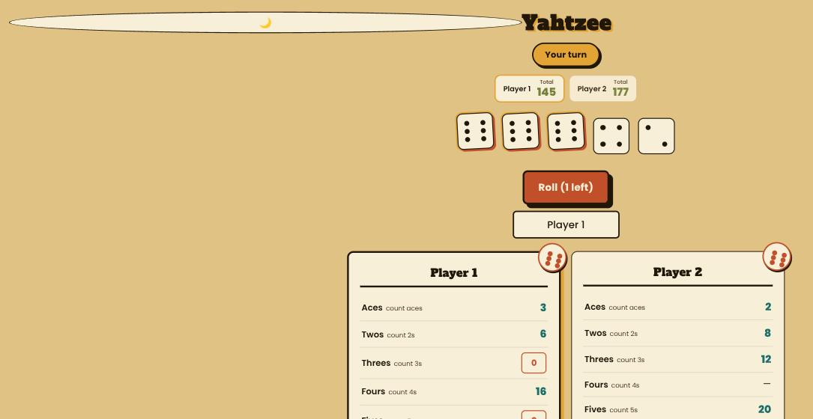
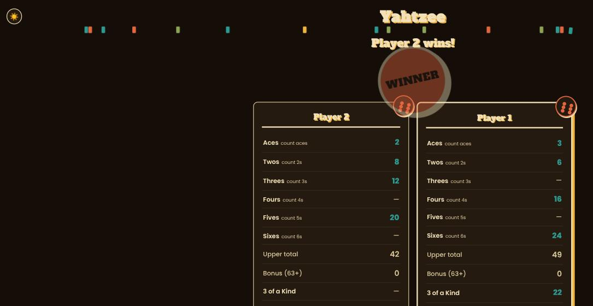
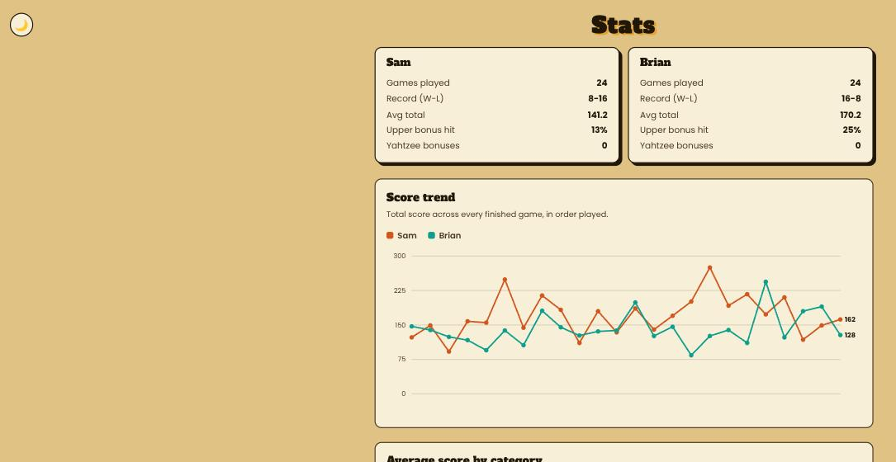

# Yahtzee (and friends)

Started as a Yahtzee game I built so my girlfriend and I could play from our phones (one iPhone, one Android) without installing anything, and grew into a small two-player game night: a lobby page, then whatever you pick. It runs as a small web server, real-time over WebSockets, so both people see moves update live on separate devices.

Yahtzee follows the actual rules, including the joker rule for extra Yahtzees, which most quick clones online skip or get wrong.

<p>
  
  
  
</p>

## Running it

```bash
npm install
npm start
```

It'll print out addresses to open on each device. If you want to play from different networks (not just the same wifi), stick it behind Tailscale or something similar.

## Tests

```bash
npm test
```

Covers the scoring rules and the turn/game flow, including the joker rule edge cases since those are the easiest part to get wrong.

## Games

- **Yahtzee** — the original. Full rules including the joker rule, dark mode, dice/scoring sound effects, and a win/lose animation.
- **Connect Four** — the second game. Same real-time two-device play, same design system, no persistence/stats (yet).
- **Battleship** — the third game. Hidden information instead of luck: each player places their fleet privately, then takes turns firing blind at the other's board. No persistence/stats (yet).

Each game is its own room with its own seats — whoever connects to a game first is "Player 1" there, the second person just joins. Switching what you're playing never loses progress on the other game; you could have both going at once.

## Stack

Just Node (`node:http`, `node:sqlite`, `ws`, `web-push`), no framework, no build step. Plain JS/CSS on the frontend.

## Install it as an app

There's a manifest + icon + service worker, so "Add to Home Screen" launches full-screen like a real app instead of opening inside browser chrome. The bell icon in the header lets you turn on "your turn" push notifications, so you don't have to keep the tab open to know when it's your move.

## Stats (Yahtzee only, for now)

Every finished Yahtzee game gets saved to a local SQLite file (`data/yahtzee.db`, gitignored — it's runtime data, not source). There's a `/stats.html` page with a score trend line chart, an average-score-per-category bar chart, win/loss records, and a recent-games table, grouped by player name rather than seat since whoever connects first becomes "Player 1" on a given day.

## About the build

I built this with Claude doing most of the actual coding — game logic, the multiplayer/networking side, and the UI — while I drove requirements and testing. Wanted to be upfront about that rather than pretend otherwise.

## Sound credits

- "Pencil Scribble (9)" by JellyDaisies — [freesound.org/s/761665](https://freesound.org/s/761665/) — Creative Commons 0
- "Dice Throw Roll on Board Game Playing Board" (1, 2, 3) — [Zapsplat.com](https://www.zapsplat.com/)
- "Plastic Board Game Pieces Drop on Carpet" — [Zapsplat.com](https://www.zapsplat.com/music/plastic-board-game-pieces-drop-on-carpet-2/)
- "Single Piece of Lego Door Drop onto Other Lego" — [Zapsplat.com](https://www.zapsplat.com/music/single-piece-of-lego-door-drop-onto-other-lego-1/)
- "Small Stone Drop into Water with a Splash" (Battleship miss) — [Zapsplat.com](https://www.zapsplat.com/music/small-stone-drop-into-water-with-a-splash-4/)
- "Slightly Distant Explosion, Exterior, Medium, with No Debris" (Battleship hit) — [Zapsplat.com](https://www.zapsplat.com/music/slightly-distant-explosion-exterior-medium-with-no-debris-early-echoes-into-clean-tail-with-slight-flange/)
- "Game_over.wav" by deleted_user_877451 (game-over sting) — [freesound.org/s/76376](https://freesound.org/s/76376/) — Attribution 3.0
- "Win.mp3" by David819 (win fanfare) — [freesound.org](https://freesound.org/) — Creative Commons 0

## Contributors

- Brian Meadows ([@BrianMeadows123](https://github.com/BrianMeadows123))
- Claude (Anthropic) — did the coding
